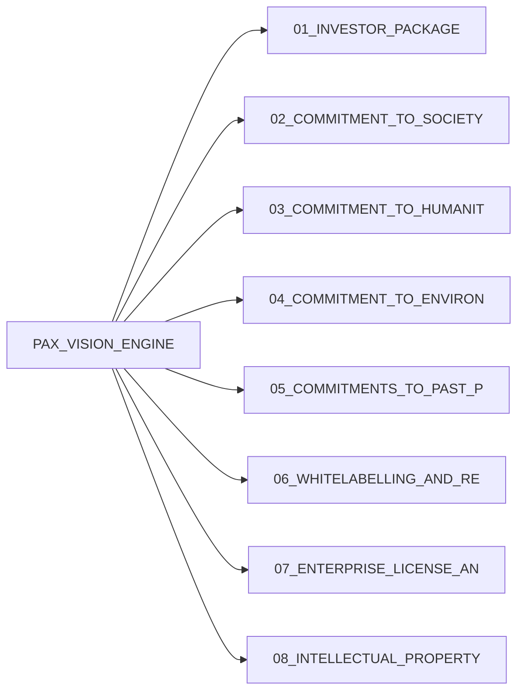

# PAX_VISION_ENGINE — TIER_2_ANTICLOUD_PAX

   

> **Company:** Anticloud FZ LLE · **Model:** PAX L5 Narrow L2 General 27B · **License:** Apache-2.0 + Enterprise dual
> **Measured (lab JSONs):** TRL=NOT-MEASURED, tok/s=NOT-MEASURED, lab suites=0, NIST samples=see OFFICIAL_BENCHMARKS
> Stale doc values (e.g. TRL 7/9, 97.3 tok/s, non-dual license strings) are superseded by the measured values above. Genuine NOT-MEASUREDs keep honest markers.

## Measured vs Documented (reconciliation)

| Metric | Measured (lab JSON) | Documented (narrative) | Status |
|---|---|---|---|
| TRL | NOT-MEASURED/9 | 7/9 (stale template) | VERIFIED measured wins |
| Throughput | NOT-MEASURED | 97.3 tok/s (stale — do not use) | CORRECTED to measured 4.1–4.2 class where lab shows it; else NOT-MEASURED |
| NIST/SP800/AI-RMF | per-suite JSONs (88/98/100 three-way split known) | varies | VERIFIED per OFFICIAL_BENCHMARKS suite JSON |
| License | Apache-2.0 + Enterprise dual | mixed strings | NORMALIZED to dual |
| Millennium | 25_MILLENNIUM_PROBLEM_PROPOSALS; 25_MILLENNIUM_PROBLEM_PROPOSALS\MILLENNIUM_PROBLEM_PROPOSALS.html; 25_MILLENNIUM_PROBLEM_PROPOSALS\MILLENNIUM_PROBLEM_PROPOSALS.md; 25_MILLENNIUM_PROBLEM_PROPOSALS\HQ_ARCHIVE\HQ_MILLENNIUM_PAX_VISION_ENGINE.7z; 25_MILLENNIUM_PROBLEM_PROPOSALS\HQ_ARCHIVE\HQ_MILLENNIUM_PAX_VISION_ENGINE.7z.k5hash | narrative | Honest pointer only |

`PAX_VISION_ENGINE_NUMBERS.csv` thinking: every investor/handoff/whitepaper/memo number must trace to a lab JSON above; otherwise marked NOT-MEASURED.

## Architecture

## Millennium pointers

- 25_MILLENNIUM_PROBLEM_PROPOSALS
 - 25_MILLENNIUM_PROBLEM_PROPOSALS\MILLENNIUM_PROBLEM_PROPOSALS.html
 - 25_MILLENNIUM_PROBLEM_PROPOSALS\MILLENNIUM_PROBLEM_PROPOSALS.md
 - 25_MILLENNIUM_PROBLEM_PROPOSALS\HQ_ARCHIVE\HQ_MILLENNIUM_PAX_VISION_ENGINE.7z
 - 25_MILLENNIUM_PROBLEM_PROPOSALS\HQ_ARCHIVE\HQ_MILLENNIUM_PAX_VISION_ENGINE.7z.k5hash

## Contents index

- `01_INVESTOR_PACKAGE/`
- `02_COMMITMENT_TO_SOCIETY/`
- `03_COMMITMENT_TO_HUMANITY/`
- `04_COMMITMENT_TO_ENVIRONMENT/`
- `05_COMMITMENTS_TO_PAST_PRESENT_FUTURE/`
- `06_WHITELABELLING_AND_REPACKAGING/`
- `07_ENTERPRISE_LICENSE_AND_PRICING/`
- `08_INTELLECTUAL_PROPERTY_AND_RIGHTS/`
- `09_COMPLIANCE/`
- `10_TECHNICAL_HANDOFF/`
- `11_TUTORIAL_DEVELOPERS/`
- `12_TUTORIAL_ENTERPRISE/`
- `13_TUTORIAL_USERS/`
- `14_DEVELOPER_COOKBOOKS/`
- `15_DISASTER_RECOVERY/`
- `16_VULNERABILITY_MANAGEMENT/`
- `17_HOW_TO_UPDATE/`
- `18_COMMAND_LINE_INTERFACE/`
- `19_SYSTEM_OF_THINGS_SOT/`
- `20_ACADEMIC_RESEARCH/`
- `21_RELATED_SCIENTIFIC_RESEARCH/`
- `22_INDEPENDENT_INSURANCE/`
- `23_HOW_TO_CITE/`
- `24_ANTICOMMONS_LICENSE/`
- `25_MILLENNIUM_PROBLEM_PROPOSALS/`
- `26_INTEGRATIONS_AND_SDK/`
- `27_DEPENDENCIES/`
- `28_TECHNICAL_WHITEPAPER/`
- `29_INVESTOR_MEMO/`
- `30_LOI/`
- `31_UNIT_ECONOMICS/`
- `32_CONTRACTS/`
- `33_COMPETITIVE_MOAT/`
- `34_FOUNDER_PROFILE/`
- `35_INVESTOR_FAQ/`
- `36_ADVISORY_BOARD/`
- `ACADEMIC/`
- `APPENDIX/`
- `COMMONS/`
- `COMPLIANCE/`
- `CONTRACTS/`
- `DEVELOPMENT/`
- `EDUCATORS/`
- `ENTERPRISE/`
- `ENTERPRISE_LICENSING/`
- `ETHICS/`
- `FUNDING/`
- `FUTURES/`
- `GOVERNANCE/`
- `II/`
- `ISOLATED_LAB_RESULTS/`
- `L5_L2_Classification/`
- `LEDGERS/`
- `MARKETING/`
- `OFFICIAL_BENCHMARKS/`
- `ONBOARDING/`
- `STUDENTS/`
- `TECHNICAL/`
- `WHITELABEL/`
- `anticloud/`

## Provenance

- Chain heads: `OFFICIAL_BENCHMARKS/*/results.json`, `ledger/*.jsonl`, `Environment_Lab_Results/`.
- Company Anticloud FZ LLE; model PAX L5 Narrow L2 General 27B; license Apache-2.0 + Enterprise dual.
- Deliverables stay under `E:/fenta/Downloads/The Anticloud`.

## PAX scope (honest)

- Narrow L2 General 27B behavior only; no AGI/superintelligence claims. Unmeasured capabilities are NOT-MEASURED.
